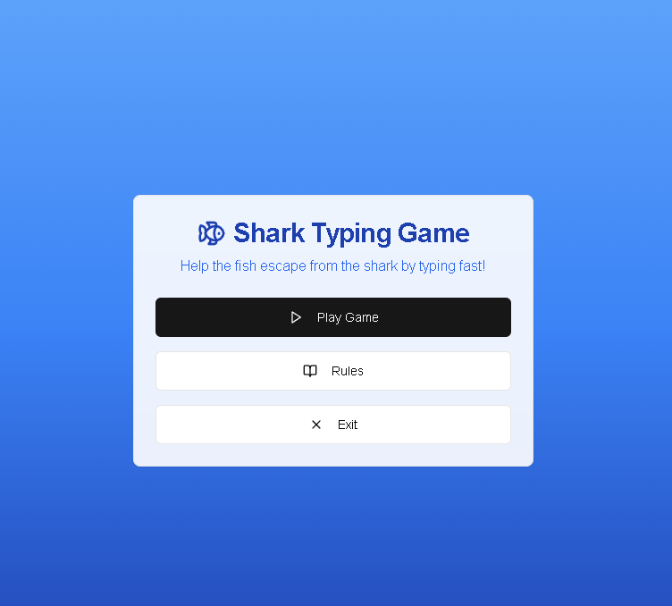
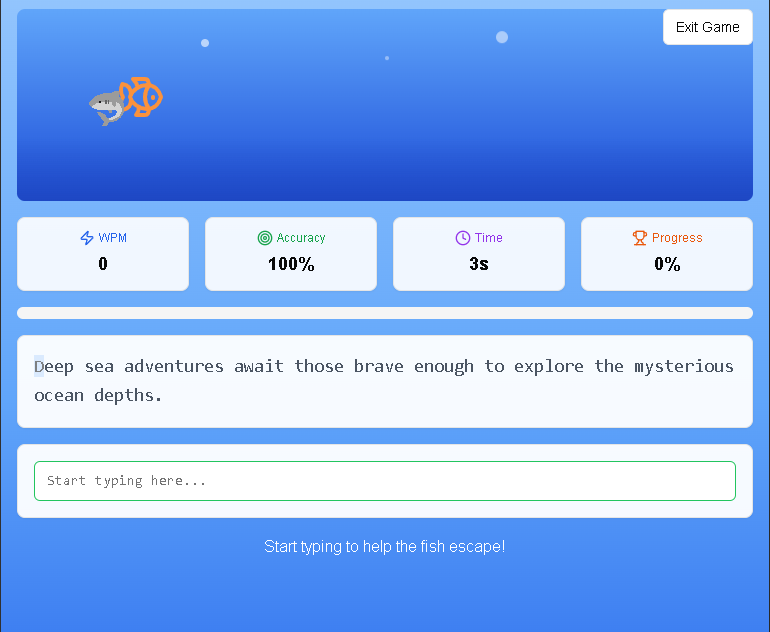
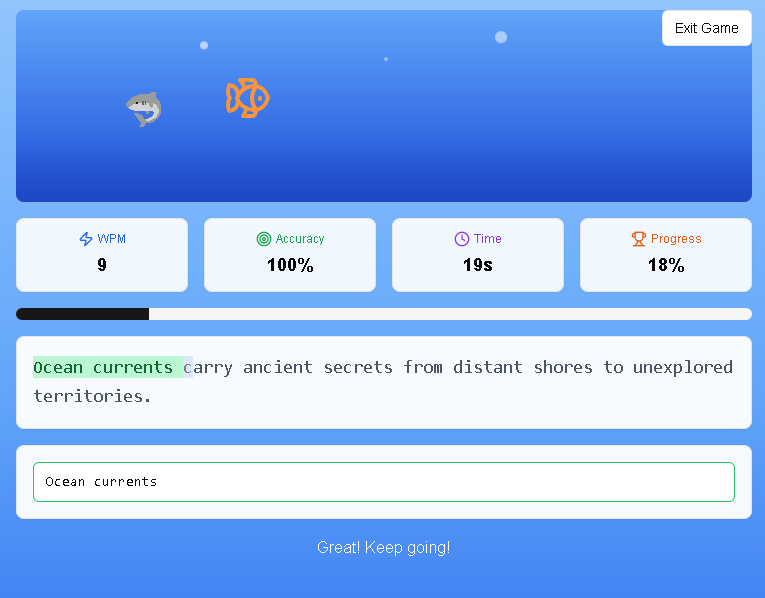
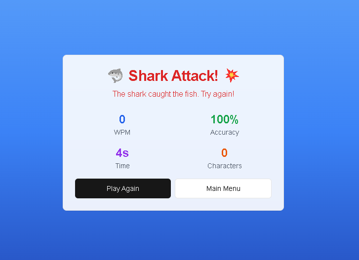

# 🦈 Shark Fish Typing Game

A fun and interactive typing game where your typing speed helps a fish escape from a chasing shark! Type quickly and accurately to save the fish and win the game.

🔗 **Live Demo:** [https://v0-typing-game-in-c.vercel.app/](https://v0-typing-game-in-c.vercel.app/)  
📦 **GitHub Repo:** [github.com/ASHU191/Shark-Fish-Typing-Game](https://github.com/ASHU191/Shark-Fish-Typing-Game)

---

## 🎮 Game Objective

Help the fish escape the shark by typing the given sentence accurately and fast. As you type:
- The fish moves forward.
- If you lag behind, the shark gets closer.
- Finish the sentence correctly before the shark catches the fish to win!

---

## 📸 Screenshots

> *(Add your screenshots in `public/screenshots/` and update these paths)*

- **Start Screen**  
  

- **Gameplay**  
  
  

- **Win/Loss Screen**  
  

---

## 🚀 Features

- ⌨️ Real-time typing feedback
- 🐠 Animated fish and 🦈 shark characters
- 📊 Stats: WPM, Accuracy, Time, Progress
- 📜 Typing rules and guide
- 🌊 Beautiful ocean-themed UI
- 📱 Fully responsive for all devices

---

## 🛠️ Built With

- [Next.js](https://nextjs.org/) – React Framework
- [TypeScript](https://www.typescriptlang.org/) – Static typing
- [Tailwind CSS](https://tailwindcss.com/) – Utility-first styling
- [Lucide React](https://lucide.dev/) – Icon library
- React Hooks – `useState`, `useEffect`, `useCallback`, `useRef`

---

## 🧩 How to Play

1. Click **Play Game** on the start screen.
2. Type the displayed sentence.
3. The fish moves forward as you type correctly.
4. If you slow down or make errors, the shark gets closer.
5. Win by finishing the sentence correctly before the shark reaches the fish!

---

## 📁 Installation

Clone the repository and run locally:

```bash
git clone https://github.com/ASHU191/Shark-Fish-Typing-Game.git
cd Shark-Fish-Typing-Game
npm install
npm run dev
